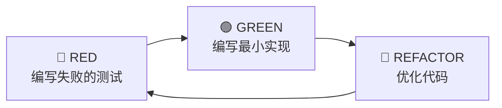

<div align="center">

# 🤖 Nano-Code

**A mini coding agent to understand AI Agent architecture from the inside out.**

[](https://python.org)
[](https://github.com/langchain-ai/langgraph)
[](LICENSE)
[](tests/)

*从零构建编码 Agent，掌握 LLM 应用核心架构*

[English](#-特色) · [快速开始](#-快速开始) · [架构设计](#️-架构设计) · [学习路径](#-学习路径)

</div>

---

## ✨ 特色

- 🔧 **工具系统** - 文件读写、代码搜索、Shell 执行，安全的工具抽象
- 🧠 **Agent 循环** - Thinking → Tool Call → Execute → Observe 完整闭环
- 💾 **智能记忆** - 自动 Token 计数与上下文压缩
- 🖥️ **交互终端** - Rich 高亮输出，代码语法着色
- 🧪 **TDD 驱动** - 完整测试覆盖，测试即文档

---

## 📸 演示

```
┌─────────────────────────────────────────────────────────────┐
│  🤖 Nano-Code                                               │
├─────────────────────────────────────────────────────────────┤
│                                                             │
│  👤 读取 README.md 并总结项目                                │
│                                                             │
│  🤖 调用 read_file("README.md")                             │
│  ────────────────────────────────────────────               │
│  📄 这是一个使用 LangGraph 构建的编码 Agent 项目...          │
│                                                             │
│  👤 搜索所有 TODO 注释                                       │
│                                                             │
│  🤖 调用 grep_search("TODO")                                │
│  ────────────────────────────────────────────               │
│  📁 src/nano_code/tools/file_tools.py:42                    │
│     # TODO: add encoding detection                          │
│                                                             │
└─────────────────────────────────────────────────────────────┘
```

---

## 🚀 快速开始

### 安装

#### 方式一：从 PyPI 安装（推荐）

```bash
# 使用 pip
pip install nano-code

# 或使用 uv tool（推荐）
uv tool install nano-code

# 运行
nano-code
```

#### 方式二：从源码安装（开发）

```bash
# 克隆项目
git clone https://github.com/afine907/nano-code.git
cd nano-code

# 安装依赖 (推荐使用 uv)
uv sync

# 运行
uv run nano-code
```

### 配置

创建 `.env` 文件（参考 `.env.example`）：

```bash
# 方式 1: OpenAI 兼容 API（如 LongCat、DeepSeek 等）
OPENAI_API_KEY=your-api-key
OPENAI_BASE_URL=https://api.longcat.chat/openai/v1
MODEL=LongCat-Flash-Chat

# 方式 2: Anthropic Claude
# OPENAI_API_KEY=
# ANTHROPIC_API_KEY=your-anthropic-api-key
# MODEL=claude-sonnet-4-20250514

# 方式 3: OpenAI 默认
# OPENAI_API_KEY=your-openai-api-key
# OPENAI_BASE_URL=
# NANO_CODE_MODEL=gpt-4o-mini
```

### 运行

```bash
uv run nano-code
```

---

## 🏗️ 架构设计

```
┌─────────────────────────────────────────────────────────────┐
│  🖥️  CLI Layer (rich + prompt-toolkit)                      │
│                                                             │
│     👤 User Input  ───────────────────▶  📺 Rich Output     │
└─────────────────────────────┬───────────────────────────────┘
                              │
                              ▼
┌─────────────────────────────────────────────────────────────┐
│  🧠  Agent Loop (LangGraph State Machine)                   │
│                                                             │
│     ┌──────────┐      ┌──────────┐      ┌──────────┐       │
│     │ 💭       │      │ ⚡       │      │ 👁️       │       │
│     │ Thinking │ ───▶ │ Execute  │ ───▶ │ Observe  │ ──┐   │
│     └──────────┘      └──────────┘      └──────────┘   │   │
│          ▲                                              │   │
│          └──────────────────────────────────────────────┘   │
└─────────────────────────────┬───────────────────────────────┘
                              │
                              ▼
┌─────────────────────────────────────────────────────────────┐
│  🔧  Tool Layer (LangChain Tools)                           │
│                                                             │
│     ┌───────────┐  ┌───────────┐  ┌───────────┐  ┌───────┐ │
│     │ 📄        │  │ ✏️        │  │ 🔍        │  │ ⚡    │ │
│     │ read_file │  │write_file │  │grep_search│  │run_cmd│ │
│     └───────────┘  └───────────┘  └───────────┘  └───────┘ │
└─────────────────────────────────────────────────────────────┘
```

### 目录结构

```text
src/nano_code/
├── agent/          # Agent 核心
│   ├── graph.py    # LangGraph 状态图定义
│   ├── state.py    # AgentState 状态结构
│   └── nodes.py    # thinking/execute 节点
│
├── tools/          # 工具实现
│   ├── file_tools.py
│   ├── search_tools.py
│   └── shell_tools.py
│
├── memory/         # 对话记忆
│   └── conversation.py
│
├── cli/            # CLI 交互
│   └── console.py
│
└── core/           # 配置与 LLM 客户端
    ├── config.py
    └── llm.py
```

---

## 📚 学习路径

通过这个项目，你将掌握：

| 主题 | 内容 | 文件 |
|------|------|------|
| **Agent 循环** | 思考-行动-观察模式 | [agent/nodes.py](src/nano_code/agent/nodes.py) |
| **状态机设计** | LangGraph 图构建 | [agent/graph.py](src/nano_code/agent/graph.py) |
| **工具抽象** | 安全的工具定义与执行 | [tools/](src/nano_code/tools/) |
| **记忆管理** | Token 计数与压缩策略 | [memory/conversation.py](src/nano_code/memory/conversation.py) |
| **TDD 实践** | 测试驱动的开发流程 | [tests/](tests/) |

---

## 🧪 开发

### 运行测试

```bash
# 运行所有测试
uv run pytest tests/ -v

# 带覆盖率报告
uv run pytest tests/ -v --cov=src/nano_code --cov-report=html
```

### TDD 工作流



---

## 🛠️ 技术栈

| 类别 | 技术 |
|------|------|
| Agent 框架 | LangGraph |
| 工具定义 | LangChain Tools |
| LLM 客户端 | langchain-openai / langchain-anthropic |
| CLI | rich + prompt-toolkit |
| 测试 | pytest + pytest-asyncio |
| 包管理 | uv |

---

## 🤝 贡献

欢迎提交 Issue 和 Pull Request！

1. Fork 本仓库
2. 创建特性分支 (`git checkout -b feature/amazing-feature`)
3. 提交更改 (`git commit -m 'feat: add amazing feature'`)
4. 推送到分支 (`git push origin feature/amazing-feature`)
5. 创建 Pull Request

---

## 📄 许可证

[MIT License](LICENSE)

---

## 🙏 致谢

- [Claude Code](https://claude.ai/code) - Anthropic 官方 CLI，本项目的灵感来源
- [LangGraph](https://github.com/langchain-ai/langgraph) - 强大的 Agent 状态机框架
- [LangChain](https://github.com/langchain-ai/langchain) - LLM 应用开发工具链

---

<div align="center">

**⭐ 如果这个项目对你有帮助，请给一个 Star！**

Made with ❤️ for learning Agent architecture

</div>
